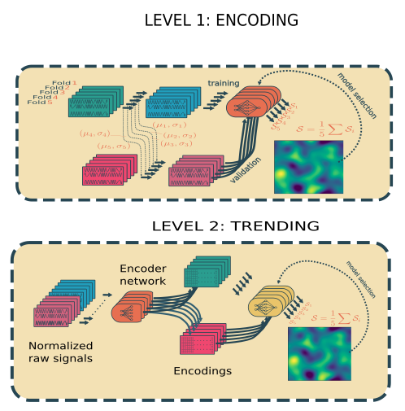

# Stacked-DCNN-RUL-PHM21
Source code of the paper "A stacked DCNN to predict the RUL of a turbofan engine", third place ranked in the PHM21 data 
challenge. If you find this code useful in your research, please consider citing:

```
@inproceedings{solis2021stacked,
  title={A stacked deep convolutional neural network to predict the remaining useful life of a turbofan engine},
  author={Sol{\'\i}s-Mart{\'\i}n, David and Gal{\'a}n-P{\'a}ez, Juan and Borrego-D{\'\i}az, Joaqu{\'\i}n},
  booktitle={Annual Conference of the PHM Society},
  volume={13},
  number={1},
  year={2021}
}
```

This work is divided in two phases or levels:
  - Level 1 (encoding) has the goal to make a dimesion reduction and noise removal. 
  - Level 2 (trending) has the goal the learn from the trend of the signal using the encodings generated by the level 1.
  
  

### Level 1 training

For training the level 1 models you only have to execute the script *train_l1.py* allocated in the directory 
*src/commands*. 

```
python train_l1.py
```

This is a example of the execution trace:

  


# ACKNOWLEDGMENT
This work has been supported by Grant PID2019-109152GBI00/AEI/10.13039/501100011033 (Agencia Estatal de Investigacion), 
Spain and by the Ministry of Science and Education of Spain through the national program "Ayudas para contratos para la 
formacion de investigadores en empresas (DIN2019)", of State Programme of Science Research and Innovations 2017-2020.
